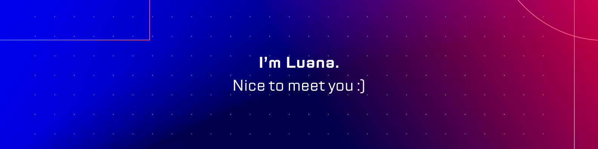

<h2 align="center">🌞 Sobre mim</h2>

🌆 Resido em Fortaleza/CE e adoro explorar cada canto da cidade, capturando momentos com minha câmera. Cada fotografia é uma história e gosto de acreditar que cada linha de código que escrevo também conta uma história.

💼 Como desenvolvedora front-end, acredito que a tecnologia e o design podem andar de mãos dadas, criando experiências incríveis para os usuários. Estou sempre em busca de aprender mais e superar meus limites.

🏞️ Nos finais de semana, é provável que você me encontre em alguma aventura por aí, desbravando novos lugares e vivendo o momento. Adoro um desafio e enfrento-o de frente, seja na vida ou no código.

🔍 Estou sempre em busca de novas oportunidades e colaborações. Se você quiser bater um papo, seja sobre tecnologia, fotografia ou as maravilhas de Salvador, estou por aqui!

<h2 align="center"> 🛸 Conecte-se comigo</h2>

  
  
  
  
  

<h2 align="center">🚀 Skills</h2>

 
  
  
  
  
  
  
  
  
  
  
  

    

